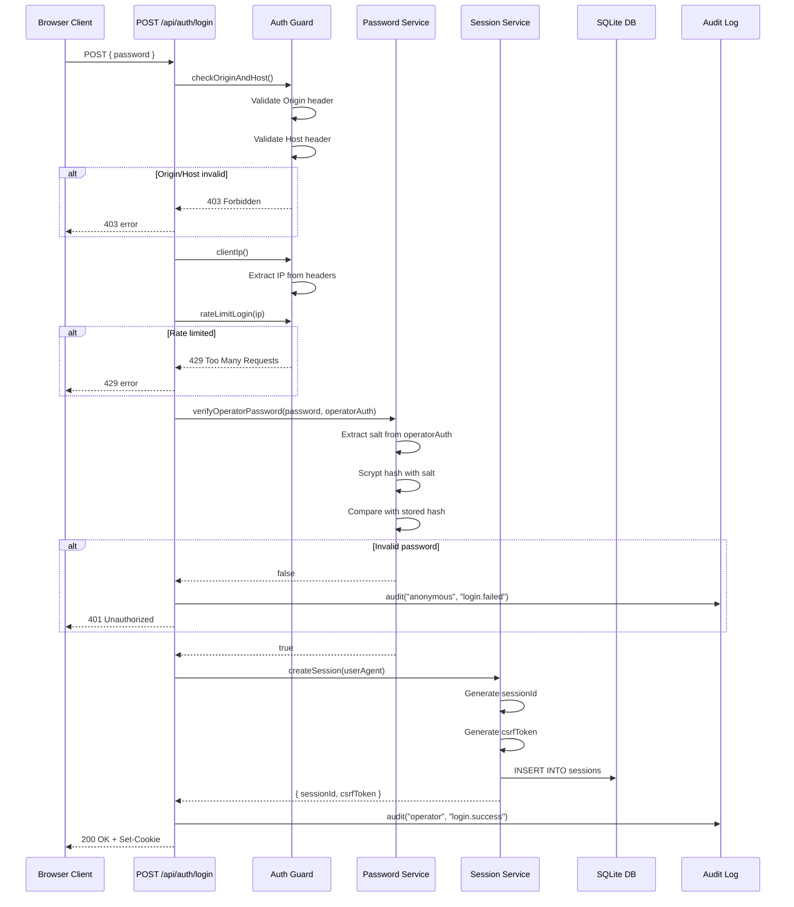
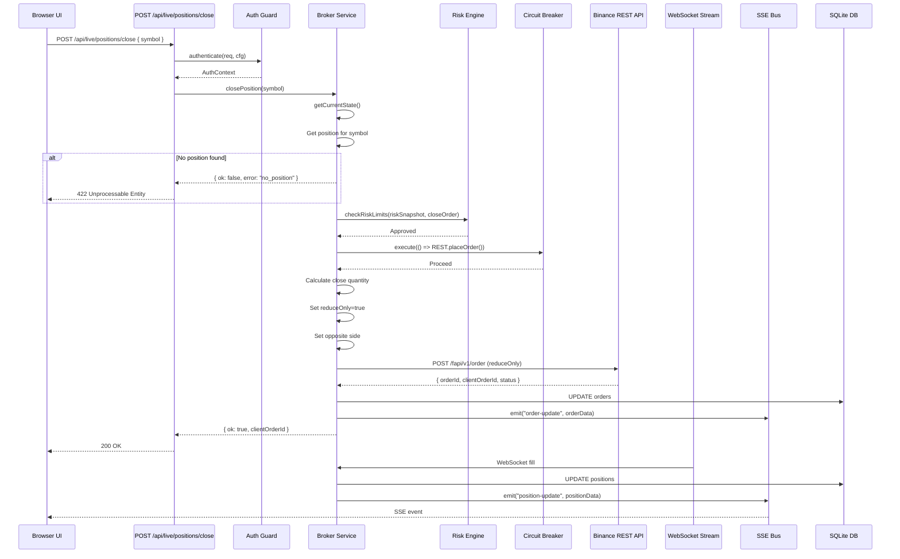
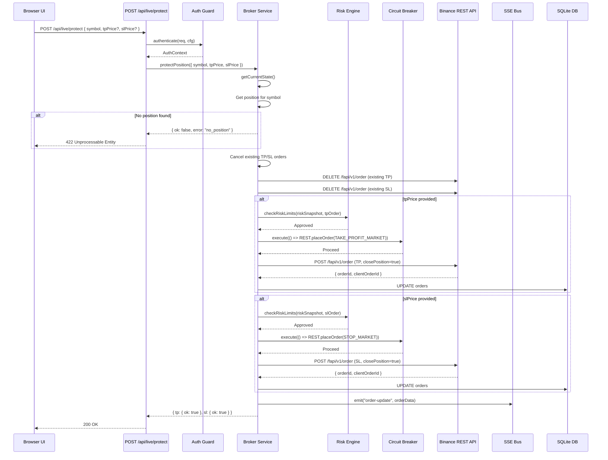
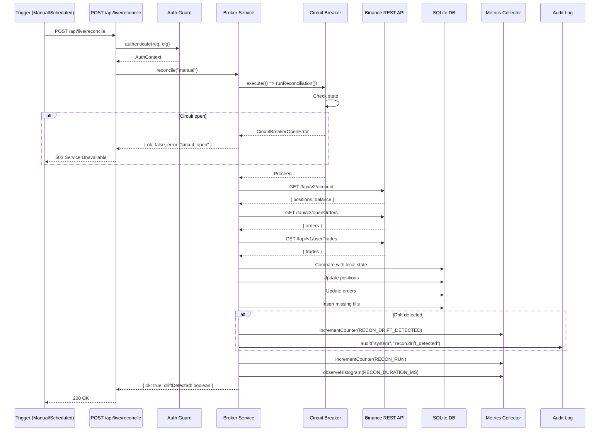
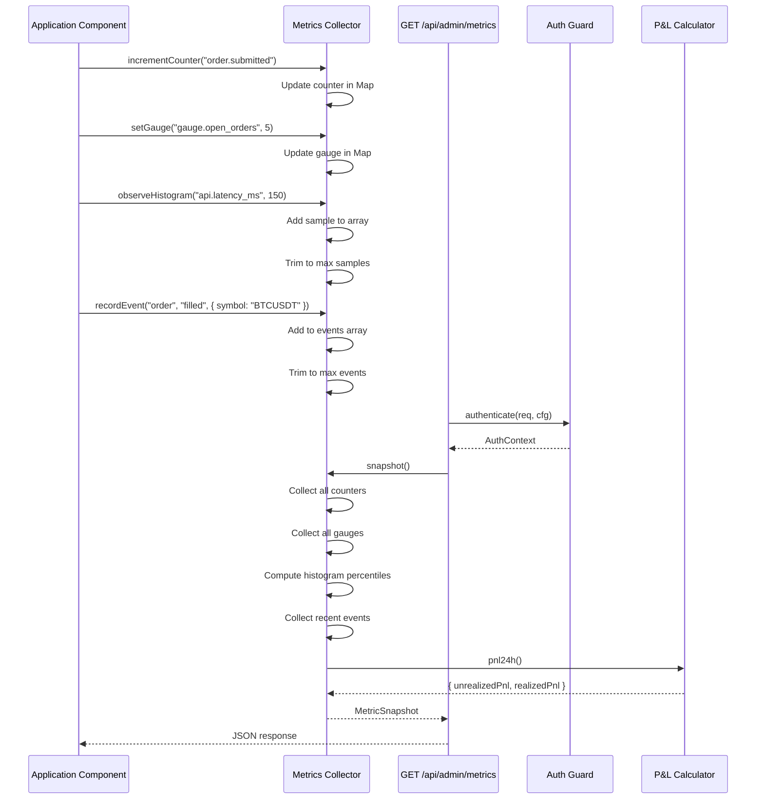

# MAWS Architecture

This document describes the system architecture, module organization, dependencies, interfaces, and sequence diagrams for core flows.

## Module Organization

### Directory Structure

```
MAWS/
├── app/                      # Next.js application layer
│   ├── api/                  # API routes
│   │   ├── auth/            # Authentication endpoints
│   │   ├── live/            # Live trading endpoints
│   │   ├── admin/           # Admin/monitoring endpoints
│   │   ├── health/          # Health check endpoints
│   │   ├── binance/         # Binance market data endpoints
│   │   ├── calendar/        # Economic calendar endpoints
│   │   ├── news/            # Market news endpoints
│   │   └── logo/            # Asset logo endpoints
│   ├── admin/               # Admin dashboard pages
│   ├── login/               # Login page
│   └── page.tsx             # Main terminal page
├── lib/                      # Shared library code
│   ├── server/              # Server-only code
│   │   ├── auth/            # Authentication service
│   │   ├── broker/          # Broker abstraction
│   │   ├── binance/         # Binance implementation
│   │   ├── db/              # Database layer
│   │   ├── env/             # Environment configuration
│   │   ├── gates/           # Execution gates
│   │   ├── health/          # Health monitoring
│   │   ├── http/            # HTTP guards
│   │   ├── log/             # Logging
│   │   ├── metrics/         # Metrics collection
│   │   ├── resilience/     # Circuit breakers
│   │   ├── runtime/         # Runtime flags
│   │   ├── validation/      # Input validation
│   │   ├── audit/           # Audit logging
│   │   └── alerts/          # Alert dispatch
│   ├── maws/                # MAWS-specific modules
│   │   ├── brand.ts         # Branding
│   │   ├── feed.ts          # Market feed
│   │   └── universe.ts      # Symbol universe
│   ├── trading/             # Trading utilities
│   │   ├── dispatch.ts      # Order dispatch
│   │   ├── exit-conditions.ts
│   │   ├── mock.ts          # Mock trading
│   │   ├── symbol-settings.ts
│   │   └── ui-orders.ts     # UI order helpers
│   └── [client libraries]   # Client-side utilities
├── components/              # React components
│   └── maws/                # MAWS-specific components
├── tests/                   # Unit tests
├── e2e/                     # End-to-end tests
└── deploy/                  # Deployment configurations
```

## Core Modules

### Broker Module (`lib/server/broker/`)

**Purpose**: Broker-agnostic interface for trading operations

**Files**:
- `interface.ts` - Core `IBroker` interface and types
- `factory.ts` - Broker instance factory
- `binance/adapter.ts` - Binance implementation of `IBroker`
- `errors.ts` - Broker-specific error types

**Key Interfaces**:
```typescript
interface IBroker {
  // Lifecycle
  connect(): Promise<void>;
  disconnect(): void;
  getStatus(): BrokerStatus;

  // Orders
  submitOrder(params: OrderParams): Promise<OrderResult>;
  cancelOrder(clientOrderId: string, symbol: string): Promise<OrderResult>;
  getOrder(symbol: string, clientOrderId: string): Promise<Order | null>;
  closePosition(symbol: string): Promise<OrderResult>;
  protectPosition(params: ProtectPositionParams): Promise<ProtectPositionResult>;

  // Positions & Account
  getPositions(): Promise<Position[]>;
  getAccount(): Promise<Account>;

  // Market Data
  getSymbolInfo(symbol: string): Promise<SymbolInfo | null>;
  getPrice(symbol: string): Promise<Price | null>;

  // Reconciliation
  snapshot(): Promise<void>;
  reconcile(trigger: string): Promise<void>;

  // State Access
  getCurrentState(): BrokerState;

  // Events
  on(event: BrokerEvent, handler: (data: unknown) => void): void;
  off(event: BrokerEvent, handler: (data: unknown) => void): void;

  // Utilities
  newClientOrderId(prefix: string): string;
}
```

**Dependencies**:
- `lib/server/binance/` - Binance-specific implementation
- `lib/server/resilience/` - Circuit breaker protection
- `lib/server/metrics/` - Metrics collection
- `lib/server/db/` - State persistence

### Binance Module (`lib/server/binance/`)

**Purpose**: Binance USD-M Futures implementation

**Files**:
- `manager.ts` - Main Binance manager orchestrates streams and REST
- `rest.ts` - REST API client with signing
- `stream.ts` - WebSocket stream management
- `orders.ts` - Order submission and management
- `recon.ts` - Reconciliation logic
- `risk.ts` - Risk limit enforcement
- `dto.ts` - Data transfer objects for API responses
- `types.ts` - Binance-specific type definitions
- `sign.ts` - Request signing
- `ratelimit.ts` - Rate limiting
- `lease.ts` - Listen key lease management
- `metadata.ts` - Symbol metadata
- `clock.ts` - Exchange clock synchronization
- `filters.ts` - Exchange filter validation
- `intents.ts` - Order intent validation
- `decimal.ts` - Decimal precision handling
- `broker-ping.ts` - Broker connectivity checks
- `state.ts` - In-memory state management
- `sse.ts` - Server-sent events bus

**Key Responsibilities**:
- WebSocket stream connection and lifecycle
- REST API calls with HMAC signing
- Order submission with risk checks
- Position and account tracking
- Reconciliation with exchange state
- Listen key lease renewal
- Exchange filter validation

**Dependencies**:
- `lib/server/broker/interface.ts` - Implements `IBroker`
- `lib/server/resilience/` - Circuit breakers for REST and streams
- `lib/server/metrics/` - Metrics collection
- `lib/server/db/` - State persistence
- `ws` - WebSocket client library

### Authentication Module (`lib/server/auth/`)

**Purpose**: Operator authentication and session management

**Files**:
- `password.ts` - Password verification with scrypt
- `session.ts` - Session creation and validation
- `token.ts` - Token comparison utilities
- `guard.ts` - HTTP request authentication guard
- `session-guard.ts` - Session-specific guard
- `page-guard.ts` - Page-level authentication

**Key Functions**:
```typescript
// Password verification
verifyOperatorPassword(password: string, operatorAuth: string): boolean

// Session management
createSession(userAgent?: string): { sessionId: string; csrfToken: string }
validateSession(sessionId: string): Session | null
revokeSession(sessionId: string): void
revokeAllSessions(): void

// HTTP guards
authenticate(req: Request, cfg: EnvConfig): AuthContext
```

**Dependencies**:
- `lib/server/db/` - Session storage
- `lib/server/audit/log.ts` - Audit logging
- Node.js `crypto` - Scrypt hashing

### Circuit Breaker Module (`lib/server/resilience/`)

**Purpose**: Failure isolation and automatic recovery

**Files**:
- `circuit-breaker.ts` - Core circuit breaker implementation
- `circuit-registry.ts` - Registry for managing multiple breakers
- `breakers.ts` - Pre-configured breaker instances

**Key Classes**:
```typescript
class CircuitBreaker {
  execute<T>(fn: () => Promise<T>): Promise<T>
  getState(): CircuitState
  getStats(): CircuitBreakerStats
  reset(): void
  forceOpen(): void
}
```

**States**:
- `closed` - Normal operation
- `open` - Rejecting requests
- `half-open` - Testing recovery

**Configured Breakers**:
- `binance-rest` - REST API breaker
- `binance-stream` - WebSocket stream breaker
- `reconciliation` - Reconciliation breaker

**Dependencies**:
- `lib/server/log/logger.ts` - Logging
- `lib/server/audit/log.ts` - Audit logging

### Metrics Module (`lib/server/metrics/`)

**Purpose**: In-memory metrics collection for observability

**Files**:
- `collector.ts` - Core metrics collector
- `pnl.ts` - P&L calculation
- `instrument.ts` - Metrics instrumentation

Health status computation lives in `lib/server/health/status.ts`, outside the metrics module.

**Metric Types**:
- **Counters**: Monotonically increasing values (orders submitted, fills received)
- **Gauges**: Current values (open orders count, balance)
- **Histograms**: Distributions (API latency, slippage)
- **Events**: Timestamped log entries

**Key Metrics**:
```typescript
const METRICS = {
  // Orders
  ORDER_SUBMITTED: "order.submitted",
  ORDER_FILLED: "order.filled",
  ORDER_CANCELED: "order.canceled",
  ORDER_REJECTED: "order.rejected",

  // API
  API_REQUEST: "api.request",
  API_ERROR: "api.error",
  API_LATENCY_MS: "api.latency_ms",

  // WebSocket
  WS_MESSAGE_RECEIVED: "ws.message_received",
  WS_RECONNECT: "ws.reconnect",
  WS_ERROR: "ws.error",

  // Reconciliation
  RECON_RUN: "recon.run",
  RECON_DRIFT_DETECTED: "recon.drift_detected",

  // Risk
  RISK_LIMIT_BREACH: "risk.limit_breach",
  FREEZE_TRIGGERED: "freeze.triggered",

  // Gauges
  OPEN_ORDERS_COUNT: "gauge.open_orders",
  OPEN_POSITIONS_COUNT: "gauge.open_positions",
  GROSS_EXPOSURE_USD: "gauge.gross_exposure_usd",
  BALANCE_USD: "gauge.balance_usd",
}
```

**Dependencies**:
- No external dependencies (pure in-memory)

### Database Module (`lib/server/db/`)

**Purpose**: SQLite database for state persistence

**Files**:
- `connection.ts` - Database connection management
- `migrate.ts` - Schema migrations
- `backup.ts` - Encrypted backup/restore

**Configuration**:
- SQLite with WAL mode for performance
- Mode 0600 for security
- Foreign keys enabled
- Busy timeout: 5s

**Dependencies**:
- `better-sqlite3` - SQLite driver
- Node.js `fs` - File operations

### Risk Module (`lib/server/binance/risk.ts`)

**Purpose**: Risk limit enforcement

**Checks**:
- Max order notional
- Max gross exposure
- Max open orders
- Max open positions
- Daily loss percentage
- Price collar percentage

**Dependencies**:
- `lib/server/env/config.ts` - Risk limit configuration
- `lib/server/broker/interface.ts` - Risk snapshot interface

### Configuration Module (`lib/server/env/config.ts`)

**Purpose**: Environment configuration and validation

**Key Configuration**:
```typescript
interface EnvConfig {
  env: MawsEnv;                    // local|testnet|shadow|production
  brokerType: BrokerType;          // binance
  dbPath: string;                  // Database file path
  operatorAuth: string | null;     // Operator credential
  allowedOrigin: string | null;    // CORS origin
  trustProxy: boolean;             // Proxy trust mode
  backupKey: Buffer | null;        // Backup encryption key

  healthToken: string | null;      // Health check token
  binanceApiKey: string | null;
  binanceApiSecret: string | null;
  recvWindowMs: number;
  rateInternalPerMin: number;
  reconIntervalMs: number;
  leaseTtlMs: number;
  alertWebhookUrl: string | null;
  risk: RiskConfig;
  circuitBreaker: CircuitBreakerConfig;
}
```

**Dependencies**:
- Node.js `process.env` - Environment variables

## Dependencies

### External Dependencies

```json
{
  "dependencies": {
    "better-sqlite3": "^12.4.1",    // SQLite database
    "dotenv": "^17.4.2",            // Environment variable loading
    "lightweight-charts": "^5.2.1", // Charting library
    "lucide-react": "^1.33.0",     // Icon library
    "next": "16.3.2",               // React framework
    "react": "19.2.8",              // UI library
    "react-dom": "19.2.8",          // React DOM
    "server-only": "^0.0.1",        // Build-time server-only check
    "ws": "^8.21.3",                // WebSocket client
    "zustand": "^5.0.15"            // State management
  }
}
```

### Internal Dependencies

```
API Layer
├── lib/server/auth/guard.ts
├── lib/server/http/guards.ts
└── lib/server/response/broker-mutation.ts

Broker Layer
├── lib/server/broker/interface.ts
├── lib/server/broker/factory.ts
└── lib/server/broker/binance/adapter.ts

Binance Implementation
├── lib/server/binance/manager.ts
├── lib/server/binance/rest.ts
├── lib/server/binance/stream.ts
├── lib/server/binance/orders.ts
├── lib/server/binance/recon.ts
└── lib/server/binance/risk.ts

Cross-cutting
├── lib/server/env/config.ts
├── lib/server/resilience/circuit-breaker.ts
├── lib/server/metrics/collector.ts
├── lib/server/db/connection.ts
└── lib/server/audit/log.ts
```

## Interfaces

### Broker Interface

The `IBroker` interface is the core abstraction for trading operations. All broker implementations must implement this interface.

**Design Principles**:
- Normalized types across brokers
- Event-driven state updates
- Async initialization
- Stateless operations

**Event Types**:
- `order-update` - Order state changed
- `account-update` - Account state changed
- `snapshot` - Initial state snapshot
- `fills` - New fills received
- `stream-status` - Stream connection status
- `health` - Health state changed

### HTTP Guard Interface

```typescript
interface AuthContext {
  authenticated: boolean;
  sessionId: string | null;
  ip: string;
  response?: Response;
}

function authenticate(req: Request, cfg: EnvConfig): AuthContext
function isAuthFailure(ctx: AuthContext): boolean
```

### Circuit Breaker Interface

```typescript
interface CircuitBreakerConfig {
  name: string;
  failureThreshold: number;
  failureWindowMs: number;
  recoveryTimeoutMs: number;
  successThreshold: number;
  isFailure?: (error: unknown) => boolean;
}

interface CircuitBreakerStats {
  state: CircuitState;
  failureCount: number;
  successCount: number;
  lastFailureTime: number | null;
  lastSuccessTime: number | null;
  openedAt: number | null;
  halfOpenAt: number | null;
  totalCalls: number;
  totalFailures: number;
  totalSuccesses: number;
  totalRejections: number;
}
```

## Sequence Diagrams

### Authentication Flow



### Order Submission Flow


### Position Close Flow



### Protect Position Flow (TP/SL)



### Reconciliation Flow



### Metrics Collection Flow



## Data Flow

### State Management

MAWS uses a hybrid state management approach:

1. **In-Memory State**: Fast access for real-time operations
   - Broker state in `lib/server/binance/state.ts`
   - Metrics in `lib/server/metrics/collector.ts`
   - Circuit breaker states

2. **Persistent State**: Durable storage for recovery
   - SQLite database for sessions, orders, fills
   - Encrypted backups for disaster recovery

3. **Event-Driven Updates**: SSE for real-time UI updates
   - Order updates via SSE
   - Position updates via SSE
   - Fill events via SSE
   - Health status updates via SSE

### Request Lifecycle

1. **Authentication**: Session validation via cookie
2. **Rate Limiting**: Per-IP rate limits on sensitive endpoints
3. **Input Validation**: Schema validation for all inputs
4. **Business Logic**: Broker operations with risk checks
5. **Circuit Breaker**: Protection against external failures
6. **Persistence**: Database updates for state changes
7. **Metrics**: Collection of operational metrics
8. **Audit Logging**: Security-relevant event logging
9. **Response**: JSON response with appropriate status

### Error Handling

Errors are handled at multiple layers:

1. **HTTP Layer**: Standard HTTP status codes
   - 400: Bad request (invalid input)
   - 401: Unauthorized (invalid session)
   - 403: Forbidden (origin/rate limit)
   - 422: Unprocessable entity (business logic)
   - 429: Too many requests (rate limit)
   - 502: Bad gateway (broker unreachable)
   - 503: Service unavailable (circuit open)

2. **Circuit Breaker Layer**: Automatic failure isolation
   - Opens on repeated failures
   - Rejects requests when open
   - Attempts recovery after timeout

3. **Audit Layer**: Logging of security-relevant events
   - Failed login attempts
   - Order submissions
   - Risk limit breaches
   - Circuit breaker state changes
