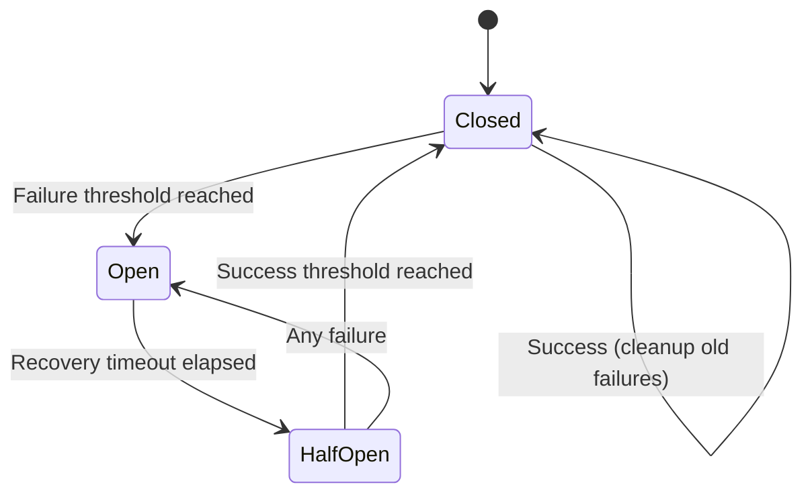

# ADR 002: Circuit Breaker Pattern for Failure Isolation

## Status

Accepted

## Context

MAWS depends on external services (Binance REST API, WebSocket streams) that can fail or become degraded. Without protection, failures can cascade and cause system-wide issues.

### Problem

When external services fail, the system needs to:
- Prevent cascading failures
- Isolate faulty components
- Recover automatically when services are healthy
- Provide visibility into failure states

### Specific Failure Scenarios

1. **Binance REST API**: Rate limits, network issues, service outages
2. **WebSocket Streams**: Connection drops, listen key expiration, network issues
3. **Reconciliation**: Database issues, API failures, data inconsistencies

## Decision

Implement the Circuit Breaker pattern with three independent circuit breakers for different external dependencies.

### Circuit Breaker States



### State Behaviors

- **Closed**: Normal operation, requests pass through, failures counted
- **Open**: Too many failures, requests immediately rejected
- **HalfOpen**: Testing recovery, limited requests allowed

### Circuit Breaker Configuration

```typescript
interface CircuitBreakerConfig {
  name: string;
  failureThreshold: number;      // Failures before opening
  failureWindowMs: number;        // Time window for counting failures
  recoveryTimeoutMs: number;      // Time before attempting recovery
  successThreshold: number;       // Successes needed to close
  isFailure?: (error: unknown) => boolean;  // Custom failure detection
}
```

### Three Independent Breakers

#### 1. REST API Breaker
- **Purpose**: Protect against Binance REST API failures
- **Configuration**: 5 failures in 60s, retry after 30s, close after 2 successes
- **Protected Operations**: Order submission, cancellation, queries

#### 2. WebSocket Stream Breaker
- **Purpose**: Protect against WebSocket connection failures
- **Configuration**: 3 failures in 5min, retry after 60s, close after 1 success
- **Protected Operations**: Stream connection, listen key renewal

#### 3. Reconciliation Breaker
- **Purpose**: Protect against reconciliation failures
- **Configuration**: 3 failures in 10min, retry after 120s, close after 2 successes
- **Protected Operations**: Manual and automatic reconciliation

### Implementation

```typescript
class CircuitBreaker {
  async execute<T>(fn: () => Promise<T>): Promise<T> {
    // Check state and attempt recovery
    if (this.state === "open") {
      this.checkForRecoveryAttempt();
    }

    // Reject if still open
    if (this.state === "open") {
      throw new CircuitBreakerOpenError(...);
    }

    // Execute function
    try {
      const result = await fn();
      this.onSuccess();
      return result;
    } catch (error) {
      this.onFailure(error);
      throw error;
    }
  }
}
```

### Usage Pattern

```typescript
const breaker = new CircuitBreaker({
  name: "binance-rest",
  failureThreshold: 5,
  failureWindowMs: 60_000,
  recoveryTimeoutMs: 30_000,
  successThreshold: 2
});

try {
  const result = await breaker.execute(() => rest.placeOrder(...));
} catch (err) {
  if (isCircuitBreakerOpen(err)) {
    // Circuit is open, service unavailable
  }
}
```

## Consequences

### Positive

- **Failure Isolation**: Prevents cascading failures
- **Automatic Recovery**: Self-healing without manual intervention
- **Visibility**: Clear state and statistics for monitoring
- **Configurable**: Tunable thresholds per dependency
- **Testable**: Easy to test failure scenarios

### Negative

- **Complexity**: Additional layer of complexity
- **Latency**: Adds small overhead to protected operations
- **Configuration**: Need to tune thresholds appropriately
- **False Positives**: May reject requests during transient issues

### Risks

- **Tuning Difficulty**: Thresholds may be too sensitive or too lenient
- **Recovery Delay**: May stay open longer than necessary
- **State Drift**: Manual reset may be needed in some cases

## Alternatives Considered

### Alternative 1: Retry with Exponential Backoff

**Pros**:
- Simpler implementation
- Handles transient failures

**Cons**:
- Doesn't isolate failures
- Can overwhelm failing service
- No visibility into failure state
- May cause cascading failures

**Rejected**: Doesn't provide failure isolation or visibility

### Alternative 2: Bulkhead Pattern

**Pros**:
- Isolates resources per dependency
- Prevents resource exhaustion

**Cons**:
- More complex to implement
- Doesn't provide automatic recovery
- Need to manage resource pools

**Rejected**: Circuit breaker provides better automatic recovery

### Alternative 3: Timeout Only

**Pros**:
- Simple implementation
- Prevents hanging

**Cons**:
- Doesn't prevent cascading failures
- No automatic recovery
- No visibility into failure state

**Rejected**: Insufficient for production system

## Implementation Notes

### Circuit Registry

A central registry (`lib/server/resilience/circuit-registry.ts`) manages all circuit breakers:

```typescript
export const circuitRegistry = {
  register(name: string, breaker: CircuitBreaker): void,
  get(name: string): CircuitBreaker | undefined,
  getAllStats(): Record<string, CircuitBreakerStats>,
  getOpenCircuits(): string[],
  reset(name: string): void,
  resetAll(): void,
};
```

### Monitoring

Circuit breaker status available via:
- API endpoint: `GET /api/admin/circuits`
- Health checks include circuit state
- Metrics track circuit state changes

### Manual Override

Emergency manual reset available (use with caution):
```typescript
breaker.reset();      // Reset to closed
breaker.forceOpen();  // Force open
```

## Configuration

Environment variables for tuning:

```bash
# REST API breaker
MAWS_CB_REST_FAILURE_THRESHOLD=5
MAWS_CB_REST_FAILURE_WINDOW_MS=60000
MAWS_CB_REST_RECOVERY_TIMEOUT_MS=30000
MAWS_CB_REST_SUCCESS_THRESHOLD=2

# WebSocket stream breaker
MAWS_CB_STREAM_FAILURE_THRESHOLD=3
MAWS_CB_STREAM_FAILURE_WINDOW_MS=300000
MAWS_CB_STREAM_RECOVERY_TIMEOUT_MS=60000
MAWS_CB_STREAM_SUCCESS_THRESHOLD=1

# Reconciliation breaker
MAWS_CB_RECON_FAILURE_THRESHOLD=3
MAWS_CB_RECON_FAILURE_WINDOW_MS=600000
MAWS_CB_RECON_RECOVERY_TIMEOUT_MS=120000
MAWS_CB_RECON_SUCCESS_THRESHOLD=2
```

## References

- [Circuit Breaker Implementation](../../lib/server/resilience/circuit-breaker.ts)
- [Circuit Registry](../../lib/server/resilience/circuit-registry.ts)
- [Circuit Breaker Documentation](../../docs/CIRCUIT_BREAKERS.md)
