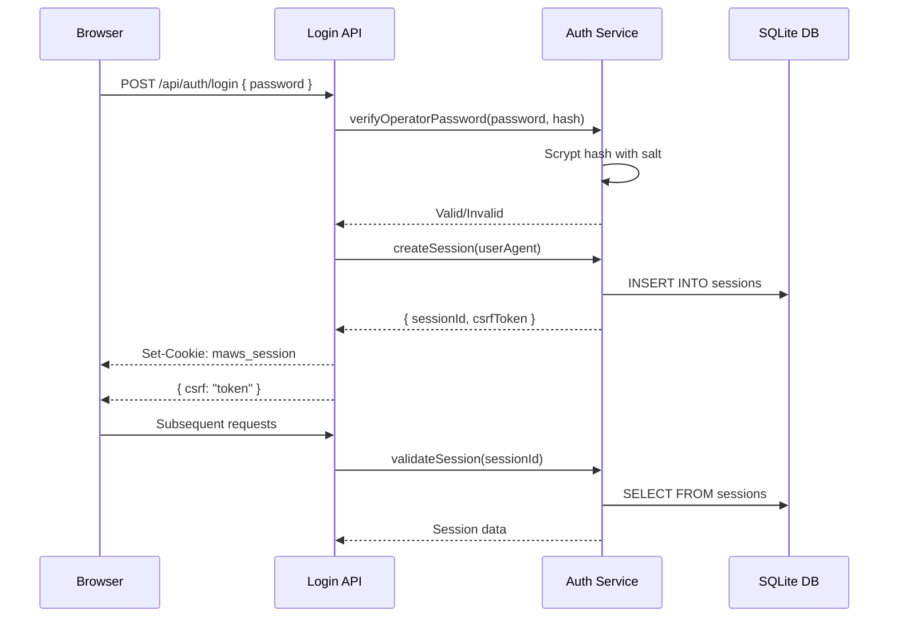

# ADR 003: Session-Based Authentication Design

## Status

Accepted

## Context

MAWS requires authentication for operator access to trading operations and Binance profile switching. The system starts in local Chart Only without an active broker, while still allowing an authenticated operator to attach a configured Binance profile without changing the server's startup configuration.

### Problem

Authentication must:
- Secure operator access to trading operations
- Support multiple concurrent sessions
- Provide CSRF protection
- Work with server-side rendering
- Allow emergency session revocation
- Be simple to implement and maintain

### Constraints

- Next.js App Router with server components
- HTTP-only cookies for security
- No external authentication providers (self-contained)
- Support for rate limiting
- Audit logging of authentication events

## Decision

Implement session-based authentication with scrypt password hashing, HTTP-only cookies, and CSRF tokens.

### Authentication Flow



### Password Storage

**Algorithm**: Scrypt with salt

**Format**: `<hex salt>:<hex scrypt hash>`

**Generation**:
```bash
npm run gen-operator-auth
```

**Storage**: Environment variable `MAWS_OPERATOR_AUTH`

**Rationale**:
- Scrypt is memory-hard, resistant to GPU/ASIC attacks
- Salt prevents rainbow table attacks
- Environment variable keeps hash out of code repository

### Session Management

**Session Structure**:
```typescript
interface Session {
  sessionId: string;      // UUID
  csrfToken: string;      // Random token
  createdAt: number;       // Timestamp
  lastSeen: number;       // Last activity
  userAgent?: string;     // Optional user agent
}
```

**Storage**: SQLite database with sessions table

**Cookie**: HTTP-only, secure, same-site

**CSRF Token**: Returned in login response, required for mutations

### Authentication Guard

```typescript
function authenticate(req: Request, cfg: EnvConfig, options = {}): AuthContext {
  // Only explicitly designated local-safe routes may run in local mode.
  if (cfg.env === "local" && options.allowLocal !== true) {
    return { authenticated: false, response: 403 };
  }

  // Validate session cookie
  const sessionId = extractSessionCookie(req);
  if (!sessionId) return { authenticated: false, response: 401 };

  // Validate session in database
  const session = validateSession(sessionId);
  if (!session) return { authenticated: false, response: 401 };

  // Update last seen
  updateSessionLastSeen(sessionId);

  return { authenticated: true, sessionId, ip: extractIp(req) };
}
```

### Rate Limiting

**Login Rate Limit**: 5 attempts per 5 minutes per IP

**Implementation**: In-memory counter with sliding window

**Rationale**: Prevents brute force attacks

### Origin Validation

**Strict Origin Checking**: Validate `Origin` and `Host` headers against `MAWS_ALLOWED_ORIGIN`

**Purpose**: CSRF protection beyond cookies

**Configuration**:
```bash
MAWS_ALLOWED_ORIGIN=https://terminal.example.com
```

### Emergency Revocation

**Revoke Single Session**:
```typescript
POST /api/auth/logout
```

**Revoke All Sessions**:
```typescript
POST /api/auth/revoke-all
```

**Use Case**: Compromised password, suspicious activity

## Consequences

### Positive

- **Security**: HTTP-only cookies prevent XSS token theft
- **CSRF Protection**: Double protection with cookies + origin validation
- **Usability**: Simple password-based authentication
- **Auditability**: All auth events logged
- **Emergency Controls**: Can revoke all sessions
- **Rate Limiting**: Prevents brute force attacks

### Negative

- **Stateful**: Requires database for session storage
- **Cookie Dependencies**: Requires cookie support
- **No MFA**: Single-factor authentication only
- **Session Expiry**: Need to handle session refresh

### Risks

- **Session Hijacking**: If cookie stolen (mitigated by HTTP-only)
- **Password Compromise**: Weak passwords (mitigated by scrypt)
- **Database Compromise**: Sessions in database (mitigated by encryption)
- **CSRF Bypass**: Origin validation bypass (mitigated by strict checking)

## Alternatives Considered

### Alternative 1: JWT (JSON Web Tokens)

**Pros**:
- Stateless (no database)
- Self-contained
- Standard approach

**Cons**:
- Harder to revoke
- Token theft more dangerous
- Larger cookie size
- Need to manage refresh tokens

**Rejected**: Session-based provides better revocation control

### Alternative 2: OAuth2 / External Provider

**Pros**:
- No password management
- Multi-factor support
- Standard protocols

**Cons**:
- External dependency
- More complex setup
- Requires user accounts with provider
- Not suitable for self-contained system

**Rejected**: Want self-contained system without external dependencies

### Alternative 3: API Key Authentication

**Pros**:
- Simple implementation
- Stateless

**Cons**:
- Harder to revoke
- No CSRF protection
- Key management complexity
- Not suitable for browser-based UI

**Rejected**: Not suitable for browser-based application

## Implementation Notes

### Local Chart Only

`MAWS_ENV=local` is the normal single startup context for the UI:

- The server starts with no active trading profile and does not start a broker manager.
- Charting and public market-data workflows remain available.
- Safe profile metadata can be displayed without a session.
- Attaching Testnet or Production requires `MAWS_OPERATOR_AUTH`, a valid session, CSRF/origin checks, configured profile credentials, and normal readiness gates.
- Paper Trading remains browser-local and never sends orders to Binance.

The default authentication guard still blocks routes that are not explicitly marked as local-safe; local mode is not a blanket authentication bypass.

### Session Expiry

Currently sessions don't expire automatically. Future enhancement:
- Add TTL to sessions
- Automatic cleanup of expired sessions
- Session refresh mechanism

### Security Headers

Set security headers on responses:
- `Set-Cookie`: HttpOnly, Secure, SameSite=Strict
- `X-Content-Type-Options: nosniff`
- `X-Frame-Options: DENY`

## Configuration

Typical single-profile local configuration:

```bash
MAWS_ENV=local
MAWS_OPERATOR_AUTH=<salt:hash>
MAWS_BINANCE_TESTNET_API_KEY=<testnet-key>
MAWS_BINANCE_TESTNET_API_SECRET=<testnet-secret>
MAWS_BINANCE_PRODUCTION_API_KEY=<production-key>
MAWS_BINANCE_PRODUCTION_API_SECRET=<production-secret>
MAWS_ALLOWED_ORIGIN=https://terminal.example.com
```

`MAWS_OPERATOR_AUTH` is required when attaching a Binance profile from local mode. Non-local startup modes remain supported for server-managed deployments and require their normal credentials and authentication.

## References

- [Password Verification](../../lib/server/auth/password.ts)
- [Session Management](../../lib/server/auth/session.ts)
- [Auth Guard](../../lib/server/auth/guard.ts)
- [Login API](../../app/api/auth/login/route.ts)
