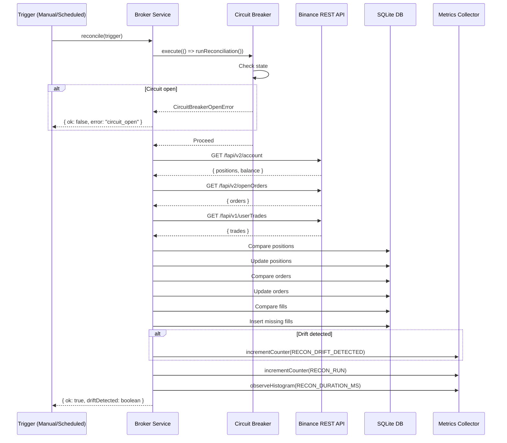

# ADR 005: Reconciliation Strategy

## Status

Accepted

## Context

MAWS maintains local state of orders, positions, and fills from exchange streams. However, streams can miss events, have delays, or be interrupted. Reconciliation ensures local state matches exchange state.

### Problem

Without reconciliation:
- Local state can diverge from exchange state
- Missed fills lead to incorrect P&L
- Stale orders may not be reflected
- Positions may be incorrect
- Risk decisions based on stale data

### Failure Scenarios

1. **Stream Interruption**: Network issues cause WebSocket disconnect
2. **Listen Key Expiration**: Binance listen key expires
3. **Message Loss**: Individual messages lost in transit
4. **Race Conditions**: REST and stream updates out of order
5. **API Errors**: REST API failures during state updates

## Decision

Implement periodic reconciliation with exchange state, plus manual trigger capability.

### Reconciliation Process



### Reconciliation Frequency

**Automatic**: Every 60 seconds (configurable via `MAWS_RECON_INTERVAL_MS`)

**Manual**: Via API endpoint `POST /api/live/reconcile`

**Rationale**:
- Frequent enough to catch drift quickly
- Not so frequent as to overwhelm API
- Manual trigger for urgent situations

### Reconciliation Scope

#### Positions
- Fetch from exchange: `GET /fapi/v2/positionRisk`
- Compare with local state
- Update local positions
- Emit position-update events

#### Orders
- Fetch from exchange: `GET /fapi/v2/openOrders`
- Compare with local state
- Update order statuses
- Cancel stale local orders
- Add missing exchange orders

#### Fills
- Fetch from exchange: `GET /fapi/v1/userTrades`
- Compare with local fills
- Insert missing fills
- Emit fill events

#### Account
- Fetch from exchange: `GET /fapi/v2/account`
- Update balance
- Emit account-update events

### Drift Detection

Drift is detected when:
- Position count differs
- Order status differs
- Fill count differs
- Balance differs significantly

**Action**: Increment `RECON_DRIFT_DETECTED` counter, log event

### Circuit Breaker Protection

Reconciliation protected by dedicated circuit breaker:
- **Failure threshold**: 3 failures in 10 minutes
- **Recovery timeout**: 120 seconds
- **Success threshold**: 2 consecutive successes

**Rationale**: Prevents reconciliation storms during API issues

### Implementation

```typescript
async reconcile(trigger: string): Promise<void> {
  // Fetch exchange state
  const exchangePositions = await rest.getPositions();
  const exchangeOrders = await rest.getOpenOrders();
  const exchangeFills = await rest.getUserTrades();
  const exchangeAccount = await rest.getAccount();

  // Compare with local state
  const positionDrift = comparePositions(exchangePositions);
  const orderDrift = compareOrders(exchangeOrders);
  const fillDrift = compareFills(exchangeFills);

  // Update local state
  if (positionDrift) updatePositions(exchangePositions);
  if (orderDrift) updateOrders(exchangeOrders);
  if (fillDrift) insertFills(exchangeFills);

  // Record metrics
  if (positionDrift || orderDrift || fillDrift) {
    incrementCounter('recon.drift_detected');
  }
  incrementCounter('recon.run');
  observeHistogram('recon.duration_ms', duration);
}
```

## Consequences

### Positive

- **State Consistency**: Local state matches exchange state
- **Error Recovery**: Recovers from stream failures
- **Data Integrity**: Ensures accurate P&L and risk calculations
- **Visibility**: Drift detection for monitoring
- **Manual Control**: Can trigger reconciliation manually

### Negative

- **API Load**: Additional REST API calls
- **Latency**: Reconciliation takes time
- **Complexity**: Additional logic to maintain
- **Cost**: More API calls may incur rate limits

### Risks

- **Rate Limits**: Frequent reconciliation may hit API limits
- **Race Conditions**: Reconciliation during active trading
- **State Overwrite**: May overwrite more recent stream updates
- **Circuit Breaker**: Reconciliation failures open circuit

## Alternatives Considered

### Alternative 1: Stream-Only (No Reconciliation)

**Pros**:
- No additional API calls
- Simpler implementation
- Lower latency

**Cons**:
- State can diverge permanently
- No recovery from stream failures
- Risk decisions based on stale data

**Rejected**: Unacceptable for production system

### Alternative 2: Event Sourcing

**Pros**:
- Complete audit trail
- Can replay events
- Strong consistency

**Cons**:
- More complex implementation
- Higher storage requirements
- Harder to implement
- Overkill for this use case

**Rejected**: Too complex for current requirements

### Alternative 3: Database as Source of Truth

**Pros**:
- Single source of truth
- No stream dependency

**Cons**:
- Requires frequent polling
- Higher latency
- Not real-time
- Higher API load

**Rejected**: Stream provides better real-time updates

## Implementation Notes

### Idempotency

Reconciliation must be idempotent:
- Can run multiple times safely
- No side effects from repeated runs
- Idempotent database operations

### Performance

Optimizations:
- Parallel REST API calls where possible
- Batch database updates
- Cache exchange metadata
- Use efficient comparisons

### Testing

Test scenarios:
- Stream interruption
- Listen key expiration
- Message loss
- API failures
- Race conditions

### Monitoring

Metrics to monitor:
- `recon.run` - Reconciliation frequency
- `recon.drift_detected` - Drift occurrences
- `recon.duration_ms` - Reconciliation latency
- Circuit breaker state

## Configuration

Environment variables:

```bash
MAWS_RECON_INTERVAL_MS=60000  # 60 seconds

# Circuit breaker
MAWS_CB_RECON_FAILURE_THRESHOLD=3
MAWS_CB_RECON_FAILURE_WINDOW_MS=600000  # 10 minutes
MAWS_CB_RECON_RECOVERY_TIMEOUT_MS=120000  # 120 seconds
MAWS_CB_RECON_SUCCESS_THRESHOLD=2
```

## References

- [Reconciliation Implementation](../../lib/server/binance/recon.ts)
- [Reconciliation API](../../app/api/live/reconcile/route.ts)
- [Circuit Breaker](002-circuit-breaker.md)
