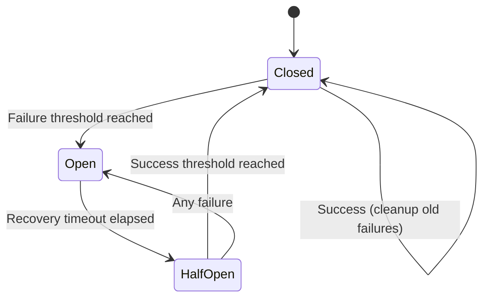

# MAWS Operations Guide

This document covers environment variables, configuration schema, secrets handling, circuit breakers, rate limits, logging/metrics, backup/restore, and incident response procedures.

## Environment Variables

### Required Variables

#### MAWS_ENV
**Description**: Deployment environment mode
**Values**: `local` | `testnet` | `shadow` | `production`
**Default**: `local`
**Purpose**: Selects the server deployment context and risk enforcement. The active trading profile is selected from the UI.

- `local`: Chart Only startup; Paper, Testnet, and Production can be attached from the UI when configured and authenticated
- `testnet`: Binance USD-M Futures Testnet startup context, requires auth and testnet credentials
- `shadow`: Production market data with read-only account, zero submissions
- `production`: Real trading, requires all risk limits and execution gates

#### MAWS_DEFAULT_PROFILE
**Description**: Optional preferred profile metadata
**Values**: `paper` | `binance-testnet` | `binance-production`
**Default**: `paper`
**Purpose**: Optional metadata for deployments that want to label a preferred profile. It does not select or switch the active runtime; the UI profile chooser is authoritative after startup.

#### MAWS_OPERATOR_AUTH
**Description**: Operator credential for authentication
**Format**: `<hex salt>:<hex scrypt hash>`
**Required**: For non-local environments and whenever Binance profiles are attached from local Chart Only
**Purpose**: Password-based authentication for operator access and live-profile switching

**Generate with**:
```bash
npm run gen-operator-auth
```

#### Profile-specific Binance credentials
The server keeps Testnet and Production credentials separate so the UI can switch profiles without changing `.env.local` or restarting the server:

| Profile | API key | API secret |
|---|---|---|
| `binance-testnet` | `MAWS_BINANCE_TESTNET_API_KEY` | `MAWS_BINANCE_TESTNET_API_SECRET` |
| `binance-production` | `MAWS_BINANCE_PRODUCTION_API_KEY` | `MAWS_BINANCE_PRODUCTION_API_SECRET` |

A key and secret must be supplied together. Missing values leave that profile
unconfigured; credentials are never copied between profiles. After operator
authentication and profile connection, MAWS enables normal submissions
automatically. Health, stream, account, reconciliation, position-mode,
freeze, kill-switch, and risk gates still block unsafe submissions. Withdrawal
permission MUST be disabled, and none of these variables may use a
`NEXT_PUBLIC_` prefix.

#### Legacy Binance credentials
`MAWS_BINANCE_API_KEY` and `MAWS_BINANCE_API_SECRET` remain supported during
migration. They apply only to the profile mapped from `MAWS_ENV`:

- `local` -> Chart Only
- `testnet` -> `binance-testnet`
- `production` -> `binance-production`
- `shadow` -> internal shadow mode using production endpoints; it is not a selectable profile

If legacy and active profile-specific credentials are both supplied and differ,
startup fails closed with `MAWS_PROFILE_CONFIGURATION_INVALID`. Legacy
credentials do not populate an unrelated profile. Local Chart Only rejects legacy
Binance credentials; use the separate profile-specific variables instead.

### Optional Variables

#### MAWS_DB_PATH
**Description**: SQLite database file path
**Default**: `.maws/maws.db`
**Purpose**: Location of persistent state storage

#### MAWS_ALLOWED_ORIGIN
**Description**: Exact origin allowed for browser requests
**Format**: `https://terminal.example.com`
**Purpose**: CSRF protection via origin validation

#### MAWS_TRUST_PROXY
**Description**: Trust reverse proxy headers
**Values**: `true` | `false`
**Default**: `false`
**Purpose**: Enable when reverse proxy strips forwarding headers

#### MAWS_BACKUP_KEY
**Description**: AES-256 key for encrypted backups
**Format**: 64 hex characters (32 bytes)
**Purpose**: Encrypt/decrypt database backups

**Generate with**:
```bash
node -e "console.log(require('crypto').randomBytes(32).toString('hex'))"
```


#### MAWS_HEALTH_TOKEN
**Description**: Shared token for health endpoints
**Format**: String
**Purpose**: External monitoring without session authentication

**Usage**: Send via `x-maws-health-token` header (never in URLs)

#### MAWS_ALERT_WEBHOOK_URL
**Description**: Out-of-band webhook alert URL
**Format**: URL (Discord, Slack, PagerDuty, or JSON POST)
**Purpose**: Alerts on fills, freezes, stream failures

### Tuning Variables

#### MAWS_RECV_WINDOW_MS
**Description**: Binance API receive window
**Default**: `5000`
**Purpose**: Time window for valid API signatures

#### MAWS_RATE_INTERNAL_PER_MIN
**Description**: Internal rate limit per minute
**Default**: `60`
**Purpose**: Rate limit for internal broker operations

#### MAWS_RECON_INTERVAL_MS
**Description**: Reconciliation interval
**Default**: `60000` (60 seconds)
**Purpose**: Automatic reconciliation frequency

#### MAWS_LEASE_TTL_MS
**Description**: Listen key lease TTL
**Default**: `60000` (60 seconds)
**Purpose**: Binance listen key renewal interval

### Risk Limit Variables

#### MAWS_RISK_MAX_ORDER_NOTIONAL
**Description**: Maximum order notional value (USD)
**Default**: `50`
**Production**: Must be positive finite number
**Purpose**: Reject orders exceeding this notional

#### MAWS_RISK_MAX_GROSS_EXPOSURE
**Description**: Maximum gross exposure (USD)
**Default**: `100`
**Production**: Must be positive finite number
**Purpose**: Limit total position exposure

#### MAWS_RISK_MAX_OPEN_ORDERS
**Description**: Maximum open orders count
**Default**: `10`
**Production**: Must be positive finite number
**Purpose**: Limit concurrent open orders

#### MAWS_RISK_MAX_OPEN_POSITIONS
**Description**: Maximum open positions count
**Default**: `3`
**Production**: Must be positive finite number
**Purpose**: Limit concurrent open positions

#### MAWS_RISK_DAILY_LOSS_PCT
**Description**: Daily loss limit percentage
**Default**: `50`
**Production**: Must be positive finite number
**Purpose**: Stop trading after daily loss percentage

#### MAWS_RISK_PRICE_COLLAR_PCT
**Description**: Price collar percentage
**Default**: `5`
**Production**: Must be positive finite number
**Purpose**: Reject orders with prices outside collar

### Circuit Breaker Variables

#### Binance REST API Breaker

**MAWS_CB_REST_FAILURE_THRESHOLD**
**Description**: Failures before opening circuit
**Default**: `5`

**MAWS_CB_REST_FAILURE_WINDOW_MS**
**Description**: Time window for failure counting
**Default**: `60000` (60 seconds)

**MAWS_CB_REST_RECOVERY_TIMEOUT_MS**
**Description**: Time before attempting recovery
**Default**: `30000` (30 seconds)

**MAWS_CB_REST_SUCCESS_THRESHOLD**
**Description**: Successes needed to close circuit
**Default**: `2`

#### WebSocket Stream Breaker

**MAWS_CB_STREAM_FAILURE_THRESHOLD**
**Description**: Failures before opening circuit
**Default**: `3`

**MAWS_CB_STREAM_FAILURE_WINDOW_MS**
**Description**: Time window for failure counting
**Default**: `300000` (5 minutes)

**MAWS_CB_STREAM_RECOVERY_TIMEOUT_MS**
**Description**: Time before attempting recovery
**Default**: `60000` (60 seconds)

**MAWS_CB_STREAM_SUCCESS_THRESHOLD**
**Description**: Successes needed to close circuit
**Default**: `1`

#### Reconciliation Breaker

**MAWS_CB_RECON_FAILURE_THRESHOLD**
**Description**: Failures before opening circuit
**Default**: `3`

**MAWS_CB_RECON_FAILURE_WINDOW_MS**
**Description**: Time window for failure counting
**Default**: `600000` (10 minutes)

**MAWS_CB_RECON_RECOVERY_TIMEOUT_MS**
**Description**: Time before attempting recovery
**Default**: `120000` (120 seconds)

**MAWS_CB_RECON_SUCCESS_THRESHOLD**
**Description**: Successes needed to close circuit
**Default**: `2`

### External Service Variables

#### FINNHUB_API_KEY
**Description**: Finnhub API key for market news
**Format**: String (from https://finnhub.io/register)
**Purpose**: Fetch market news data

## Configuration Schema

The complete configuration schema is defined in `lib/server/env/config.ts`:

```typescript
interface EnvConfig {
  // Startup context and active profile identity
  env: MawsEnv;                    // local|testnet|shadow|production
  brokerType: BrokerType;          // binance
  defaultProfile: ProfileId;       // optional metadata; UI switches at runtime
  activeProfileId: ProfileId|null;  // null for internal shadow mode
  profiles: ProfileRegistry;        // server-only credentials and endpoints

  // Database
  dbPath: string;                  // Database file path

  // Authentication
  operatorAuth: string | null;     // Operator credential
  allowedOrigin: string | null;    // CORS origin
  trustProxy: boolean;             // Proxy trust mode

  // Backup
  backupKey: Buffer | null;        // Backup encryption key

  // Execution
  healthToken: string | null;      // Health check token

  // Broker Credentials (legacy active aliases retained for compatibility)
  binanceApiKey: string | null;
  binanceApiSecret: string | null;

  // Tuning
  recvWindowMs: number;
  rateInternalPerMin: number;
  reconIntervalMs: number;
  leaseTtlMs: number;

  // Alerts
  alertWebhookUrl: string | null;

  // Risk Limits
  risk: {
    maxOrderNotionalUsd: number;
    maxGrossExposureUsd: number;
    maxOpenOrders: number;
    maxOpenPositions: number;
    dailyLossPct: number;
    priceCollarPct: number;
  };

  // Circuit Breakers
  circuitBreaker: {
    // REST API breaker
    restFailureThreshold: number;
    restFailureWindowMs: number;
    restRecoveryTimeoutMs: number;
    restSuccessThreshold: number;

    // WebSocket stream breaker
    streamFailureThreshold: number;
    streamFailureWindowMs: number;
    streamRecoveryTimeoutMs: number;
    streamSuccessThreshold: number;

    // Reconciliation breaker
    reconFailureThreshold: number;
    reconFailureWindowMs: number;
    reconRecoveryTimeoutMs: number;
    reconSuccessThreshold: number;
  };
}
```

## Secrets Handling

### Principles

1. **Never commit secrets**: All secrets in environment variables only
2. **Fail closed**: Missing or invalid secrets cause startup failure
3. **Environment isolation**: Different credentials per environment
4. **Minimal permissions**: Broker credentials have withdrawal disabled
5. **Regular rotation**: Rotate API keys and passwords regularly

### Secret Storage

#### Environment Variables
- Store in `.env` file (gitignored)
- Use `.env.example` as template
- Never commit `.env` to version control

#### Database
- SQLite file with mode 0600 (owner read/write only)
- Encrypted backups with AES-256
- No secrets in database

#### Session Storage
- Sessions stored in SQLite
- Session IDs are random UUIDs
- CSRF tokens are random strings

### Secret Generation

#### Operator Password
```bash
npm run gen-operator-auth
```
Output: `<hex salt>:<hex scrypt hash>`

#### Backup Key
```bash
node -e "console.log(require('crypto').randomBytes(32).toString('hex'))"
```
Output: 64 hex characters

#### Health Token
```bash
node -e "console.log(require('crypto').randomBytes(32).toString('hex'))"
```
Output: 64 hex characters

### Secret Rotation

#### Binance API Keys
1. Generate new keys in Binance dashboard
2. Update environment variables
3. Restart MAWS service
4. Revoke old keys after verification

#### Operator Password
1. Generate new hash with `npm run gen-operator-auth`
2. Update `MAWS_OPERATOR_AUTH`
3. Restart MAWS service
4. All existing sessions are invalidated

#### Backup Key
1. Generate new key
2. Update `MAWS_BACKUP_KEY`
3. Create new backup with new key
4. Delete old backups (or re-encrypt)

## Circuit Breakers

### Overview

MAWS uses three independent circuit breakers for failure isolation:

1. **REST API Breaker**: Protects against Binance REST API failures
2. **WebSocket Stream Breaker**: Protects against WebSocket connection failures
3. **Reconciliation Breaker**: Protects against reconciliation failures

### Circuit Breaker States



### REST API Breaker

**Purpose**: Protect against Binance REST API failures

**Configuration**:
- Failure threshold: 5 failures in 60 seconds
- Recovery timeout: 30 seconds
- Success threshold: 2 consecutive successes

**Protected Operations**:
- Order submission
- Order cancellation
- Position close
- Protect position (TP/SL)
- Account queries
- Order queries

**Behavior**:
- Opens after 5 failures in 60s
- Rejects all REST API calls when open
- Attempts recovery after 30s
- Closes after 2 consecutive successes

### WebSocket Stream Breaker

**Purpose**: Protect against WebSocket connection failures

**Configuration**:
- Failure threshold: 3 failures in 5 minutes
- Recovery timeout: 60 seconds
- Success threshold: 1 success

**Protected Operations**:
- WebSocket connection establishment
- Listen key renewal
- Stream message processing

**Behavior**:
- Opens after 3 failures in 5min
- Rejects reconnection attempts when open
- Attempts recovery after 60s
- Closes after 1 successful connection

### Reconciliation Breaker

**Purpose**: Protect against reconciliation failures

**Configuration**:
- Failure threshold: 3 failures in 10 minutes
- Recovery timeout: 120 seconds
- Success threshold: 2 consecutive successes

**Protected Operations**:
- Manual reconciliation
- Automatic reconciliation

**Behavior**:
- Opens after 3 failures in 10min
- Rejects reconciliation when open
- Attempts recovery after 120s
- Closes after 2 consecutive successes

### Circuit Breaker Monitoring

#### Check Circuit Status
```bash
curl -H "Cookie: maws_session=..." \
  http://localhost:3000/api/admin/circuits
```

#### Response
```json
{
  "env": "testnet",
  "circuits": {
    "binance-rest": {
      "state": "closed",
      "failureCount": 0,
      "totalCalls": 100,
      "totalFailures": 2,
      "totalRejections": 0
    }
  },
  "openCircuits": [],
  "hasOpenCircuits": false
}
```

### Circuit Breaker Recovery

#### Automatic Recovery
Circuit breakers automatically attempt recovery based on configured timeouts. No manual intervention required.

#### Manual Reset (Emergency)
Use with caution - only when you're certain the underlying issue is resolved.

```bash
# This endpoint may not be exposed in production
# Check code for availability
curl -X POST -H "Cookie: maws_session=..." \
  http://localhost:3000/api/admin/circuits/reset
```

## Rate Limits

### Authentication Rate Limits

#### Login Endpoint
- **Limit**: 5 attempts per 5 minutes per IP
- **Purpose**: Prevent brute force attacks
- **Response**: 429 Too Many Requests

#### Session Validation
- **Limit**: 120 requests per minute per session
- **Purpose**: Prevent session abuse
- **Response**: 429 Too Many Requests

### Trading API Rate Limits

#### Order Submission
- **Limit**: 60 requests per minute per session
- **Purpose**: Prevent order spam
- **Response**: 429 Too Many Requests

#### Other Live Trading Endpoints
- **Limit**: 120 requests per minute per session
- **Purpose**: General API protection
- **Response**: 429 Too Many Requests

### Admin API Rate Limits

#### Metrics Endpoint
- **Limit**: 60 requests per minute per session
- **Purpose**: Prevent metrics abuse
- **Response**: 429 Too Many Requests

#### Health Endpoints
- **Limit**: 120 requests per minute per session
- **Purpose**: Allow frequent health checks
- **Response**: 429 Too Many Requests

### Market Data Rate Limits

#### Public Endpoints
- **Limit**: 300 requests per minute per IP
- **Purpose**: Prevent abuse of public endpoints
- **Response**: 429 Too Many Requests

### Binance API Rate Limits

MAWS respects Binance API rate limits internally:

- **REST API**: 2400 requests per minute (weight-based)
- **WebSocket**: No explicit limit (connection-based)
- **Order Rate**: 100 orders per 10 seconds per symbol

MAWS implements internal rate limiting to stay within Binance limits.

## Logging

### Log Levels

- **error**: Critical errors requiring immediate attention
- **warn**: Warning conditions that should be investigated
- **info**: Normal operational messages
- **debug**: Detailed debugging information

### Log Locations

- **Console**: Standard output/stderr
- **File**: Not currently implemented (future enhancement)
- **Audit**: Security-relevant events in database

### Audit Log

The audit log captures security-relevant events:

```typescript
// Audit events
audit("operator", "login.success", { secure: true }, ip);
audit("operator", "order.ui.accepted", { symbol, clientOrderId }, ip);
audit("system", "circuit_breaker.opened", { circuit: "binance-rest" });
audit("system", "recon.drift_detected", { driftCount: 5 });
```

**Audit Event Types**:
- Authentication events (login, logout, session revocation)
- Order events (submission, cancellation, rejection)
- Risk events (limit breaches, freezes)
- Circuit breaker events (state changes)
- Reconciliation events (drift detection)
- System events (startup, shutdown)

### Log Rotation

Currently not implemented. Logs go to stdout/stderr and are managed by the service manager (systemd, Docker, etc.).

### Log Analysis

#### View Logs (systemd)
```bash
sudo journalctl -u maws -f
```

#### View Logs (Docker)
```bash
docker logs -f maws
```

#### Filter for Errors
```bash
sudo journalctl -u maws | grep ERROR
```

#### Filter for Audit Events
```bash
sudo journalctl -u maws | grep audit
```

## Metrics

### Metric Types

#### Counters
Monotonically increasing values:
- `order.submitted` - Total orders submitted
- `order.filled` - Total orders filled
- `order.canceled` - Total orders canceled
- `order.rejected` - Total orders rejected
- `fill.received` - Total fills received
- `api.request` - Total API requests
- `api.error` - Total API errors
- `ws.message_received` - Total WebSocket messages
- `ws.reconnect` - Total WebSocket reconnections
- `recon.run` - Total reconciliation runs
- `recon.drift_detected` - Total drift detections
- `risk.limit_breach` - Total risk limit breaches
- `freeze.triggered` - Total freeze triggers

#### Gauges
Current values:
- `gauge.open_orders` - Current open orders count
- `gauge.open_positions` - Current open positions count
- `gauge.gross_exposure_usd` - Current gross exposure
- `gauge.balance_usd` - Current account balance
- `gauge.ws_last_event_age_ms` - Time since last WebSocket event

#### Histograms
Distributions with percentiles:
- `order.submission_duration_ms` - Order submission latency
- `api.latency_ms` - API call latency
- `fill.slippage_bps` - Fill slippage in basis points
- `ws.lag_ms` - WebSocket message lag
- `recon.duration_ms` - Reconciliation duration

#### Events
Timestamped log entries:
- Order events
- Fill events
- Position events
- Reconciliation events
- Stream events
- Freeze events
- Error events
- System events

### Metrics Collection

Metrics are collected in-memory and accessible via:

```bash
curl -H "Cookie: maws_session=..." \
  http://localhost:3000/api/admin/metrics
```

**Response**:
```json
{
  "timestamp": 1234567890000,
  "uptime_seconds": 3600,
  "pnl_24h": {
    "unrealizedPnl": 50.00,
    "realizedPnl": -10.00
  },
  "counters": {
    "order.submitted": 100,
    "order.filled": 95
  },
  "gauges": {
    "gauge.open_orders": 3,
    "gauge.balance_usd": 5000.00
  },
  "histograms": {
    "api.latency_ms": {
      "count": 1000,
      "avg": 50,
      "p50": 45,
      "p95": 100,
      "p99": 200
    }
  },
  "recent_events": [...]
}
```

### Metrics Retention

- **Counters/Gauges**: Retained indefinitely (until reset)
- **Histograms**: Last 1000 samples
- **Events**: Last 100 events

### Metrics Export

Currently metrics are only available via API. Future enhancements may include:
- Prometheus export format
- StatsD export
- Custom metrics backends

## Backup and Restore

### Backup Creation

#### Automatic Backups
The application backup scheduler invokes `createEncryptedBackup()` from
`lib/server/db/backup.ts` through `instrumentation.ts` when a backup key is configured.
If an external scheduler is used, invoke the deployment’s supported application backup
entry point; this repository does not ship a standalone `scripts/backup.mjs` command.

#### Manual Backup
The repository does not ship a standalone `scripts/backup.mjs` command. Backups are
created by the server backup service in `lib/server/db/backup.ts` (normally through
`instrumentation.ts`) and require `MAWS_BACKUP_KEY`. Do not copy the live SQLite file
while MAWS is running; use the SQLite backup API path so WAL state is included.

**Requirements**:
- `MAWS_BACKUP_KEY` must be set to 64 hex characters
- Database must be accessible
- The resulting `.db.enc` file must pass the restore dry run

**Output**:
- Backup file: `.maws/backups/maws-<timestamp>.db.enc`
- Encrypted with AES-256-GCM

### Backup Storage

**Location**: `.maws/backups/`

**Naming**: `<timestamp>.db.enc`

**Retention**: The backup service keeps the newest seven encrypted backups; apply any
additional off-host retention policy separately.

### Restore Procedure

#### Dry Run (Verify)
```bash
node scripts/restore-backup.mjs .maws/backups/<file>.db.enc --dry-run
```

#### Actual Restore
```bash
node scripts/restore-backup.mjs .maws/backups/<file>.db.enc
```

**Requirements**:
- `MAWS_BACKUP_KEY` must match the key used for backup
- MAWS service should be stopped during restore

**Process**:
1. Stop MAWS service
2. Run restore command
3. Start MAWS service
4. Verify data integrity

### Profile-Scoped Database Migration

The browser profile selector is enabled for authenticated operators. Server-side profile switching is protected by the live profile API and coordinator. The profile-scoped schema migration separates
paper, Binance Testnet, Binance Production, and shadow persistence. Existing rows without
provenance are preserved under `profile_id = 'legacy-unknown'`; MAWS never classifies them
from the current environment, credentials, symbols, timestamps, or IDs. Quarantined rows
are excluded from active live queries, risk checks, P&L, reconciliation, health, selected
profile history, and execution decisions.

Do not migrate the real database in place. The operator procedure is:

1. Stop MAWS and confirm no process has the database open.
2. Back up the database and WAL/SHM files if present.
3. Verify the encrypted backup with `node scripts/restore-backup.mjs <backup>.db.enc --dry-run`.
4. Copy the database, including its WAL/SHM state when present, to a staging path.
5. Run the normal MAWS migration against the copy using its staging `MAWS_DB_PATH`.
6. Run `PRAGMA integrity_check`, `PRAGMA foreign_key_check`, schema/constraint checks,
   row-count checks, and `legacy-unknown` quarantine-count checks on the copy.
7. Promote only the verified copy; do not overwrite the original until all checks pass.
8. Keep the original database and verified backup until the promoted copy is trusted.
9. If validation fails, discard the staging copy and restore the original or verified backup.

There is no down migration. Rollback means stopping MAWS and restoring the original
database or a verified backup. No orders are cancelled and no positions are flattened by
this migration.

### Backup Encryption

**Algorithm**: AES-256-GCM

**Key**: 64 hex characters (32 bytes) from `MAWS_BACKUP_KEY`

**Security**:
- Key never stored in backup file
- Key never logged
- Key required for restore

### Backup Verification

#### Verify Backup Integrity
```bash
# Dry run will verify decryption without restoring
node scripts/restore-backup.mjs .maws/backups/<file>.db.enc --dry-run
```

#### Verify After Restore
1. Check health endpoint: `GET /api/health`
2. Verify account balance matches expected
3. Verify positions match expected
4. Verify recent orders are present

## Incident Response

### Severity Levels

#### P0 - Critical
- System completely down
- Orders not executing
- Unusual position state
- Data corruption

#### P1 - High
- Degraded performance
- Partial service outage
- Circuit breakers open
- Reconciliation failures

#### P2 - Medium
- Single endpoint failures
- High error rates
- Performance degradation
- Alert webhook failures

#### P3 - Low
- Minor bugs
- UI issues
- Documentation errors

### Incident Response Procedure

#### 1. Detection
- Monitoring alerts (health endpoint, metrics)
- User reports
- Log anomalies
- Circuit breaker state changes

#### 2. Assessment
- Check health endpoint: `GET /api/health`
- Check circuit breakers: `GET /api/admin/circuits`
- Check metrics: `GET /api/admin/metrics`
- Review logs: `journalctl -u maws`

#### 3. Containment
- If orders not executing: Check execution gates
- If circuit breakers open: Wait for recovery or manual reset
- If broker unreachable: Check network connectivity
- If database issues: Restore from backup

#### 4. Resolution
- Apply fix (configuration change, code fix, etc.)
- Verify fix (health checks, manual testing)
- Monitor for recurrence

#### 5. Post-Incident
- Document incident
- Update runbook
- Implement preventive measures
- Schedule follow-up review

### Common Incidents

#### Orders Not Executing

**Symptoms**:
- Orders submitted but not reaching exchange
- Orders stuck in "new" state
- No fills received

**Investigation**:
1. Check execution gate: `GET /api/health`
2. Check circuit breakers: `GET /api/admin/circuits`
3. Check broker connection: `GET /api/health/broker`
4. Review order submission logs

**Resolution**:
- If execution gate closed: Enable via `POST /api/live/gates`
- If circuit breaker open: Wait for recovery or manual reset
- If broker disconnected: Reconnect via `POST /api/live/connect`
- If risk limit breach: Adjust risk limits or order parameters

#### Circuit Breaker Open

**Symptoms**:
- Operations rejected with "circuit open" errors
- API calls failing with 503
- Circuit state shows "open"

**Investigation**:
1. Check circuit status: `GET /api/admin/circuits`
2. Review logs for failure causes
3. Check external service status (Binance API)

**Resolution**:
- Wait for automatic recovery (configured timeout)
- If urgent and root cause resolved: Manual reset (cautious)
- Address root cause (network, API issues, rate limits)

#### Stream Disconnections

**Symptoms**:
- SSE events stop arriving
- Stream status shows disconnected
- Reconnection attempts failing

**Investigation**:
1. Check stream status: `GET /api/live/stream-status`
2. Check WebSocket circuit breaker
3. Review WebSocket logs
4. Check network connectivity

**Resolution**:
- Manual reconnect: `POST /api/live/connect`
- If circuit breaker open: Wait for recovery
- Check Binance service status
- Verify listen key is valid

#### Database Corruption

**Symptoms**:
- Database errors in logs
- Data inconsistencies
- Failed queries

**Investigation**:
1. Check database file permissions
2. Verify disk space
3. Check SQLite integrity

**Resolution**:
- Restore from recent backup
- If no backup: Attempt SQLite recovery
- Investigate root cause (disk failure, etc.)

#### Authentication Failures

**Symptoms**:
- 401 errors on login
- Session invalidation
- Rate limiting

**Investigation**:
1. Verify `MAWS_OPERATOR_AUTH` format
2. Check session storage
3. Review audit logs
4. Check rate limit status

**Resolution**:
- Regenerate operator password
- Clear all sessions: `POST /api/auth/revoke-all`
- Adjust rate limits if needed
- Check for brute force attacks

### Escalation Procedures

#### When to Escalate
- P0 incidents not resolved in 15 minutes
- P1 incidents not resolved in 1 hour
- Unknown root cause
- Potential data loss
- Security incidents

#### Escalation Contacts
- On-call engineer
- Engineering lead
- Security team (for security incidents)

### Communication

#### During Incident
- Update status page (if available)
- Notify stakeholders (if critical)
- Document actions taken

#### Post-Incident
- Write incident report
- Share lessons learned
- Update documentation

## Monitoring

### Health Checks

#### Basic Health Check
```bash
curl http://localhost:3000/api/health
```

#### Health Check with Token
```bash
curl -H "x-maws-health-token: <token>" \
  http://localhost:3000/api/health
```

#### Broker Health Check
```bash
curl -H "x-maws-health-token: <token>" \
  http://localhost:3000/api/health/broker
```

### Metrics Monitoring
#### Collect Metrics
```bash
curl -H "x-maws-health-token: <token>" \
  http://localhost:3000/api/admin/metrics
```

## Admin dashboard troubleshooting

The admin dashboard is available at `http://localhost:3000/admin` and refreshes its health, performance, and metrics requests every five seconds. The dashboard calls `/api/admin/health`, `/api/admin/performance`, and `/api/admin/metrics`; use the health endpoints below to distinguish an application problem from an authentication or connectivity problem.

### Authentication and environment behavior

- In `MAWS_ENV=local` (the default), `/api/health` and `/api/admin/health` allow anonymous access. Local startup is Chart Only; charting and browser-local Paper Trading remain available without credentials.
- When Binance profile credentials are configured, attaching Testnet or Production from Chart Only requires `MAWS_OPERATOR_AUTH` and an authenticated operator session. The profile chooser exposes only safe metadata.
- Outside local mode, health and admin endpoints require either a valid operator session or the `x-maws-health-token` header when `MAWS_HEALTH_TOKEN` is configured. Keep the token out of URLs, query parameters, browser history, logs, and source control.
- To use a session, sign in at `/login` and then return to `/admin`.

```bash
# Session-independent access for monitoring (non-local modes)
curl -H "x-maws-health-token: <token>" \
  http://localhost:3000/api/health

curl -H "x-maws-health-token: <token>" \
  http://localhost:3000/api/admin/health
```

A `401` response in a non-local environment means that neither authentication method was accepted. A `401` should not occur solely because the server is in local mode.

### Common dashboard errors

| Symptom | Likely cause | Action |
|---|---|---|
| `Failed to fetch metrics` or a network error | The development server is stopped, the port is wrong, or the request failed before reaching the API | Run `npm run dev`, confirm the port in the terminal, then retry `/admin` |
| `Not authenticated` or `401` | Missing/expired operator session or invalid health-token header | Log in at `/login`, or send `x-maws-health-token` to the endpoint; do not put the token in the URL |
| `Local mode` or empty/zero live metrics | `MAWS_ENV=local` with no active profile, or no live manager/broker is configured | This is expected for Chart Only. Attach a configured Testnet or Production profile from the UI after authenticating; no restart is required for switching |
| `500` from a health endpoint | Server-side configuration or health-check failure | Inspect the server terminal logs and validate environment configuration |
| `Connection refused` | No process is listening on the configured port | Start MAWS with `npm run dev` and use the displayed URL |

### Direct diagnostic checklist

1. Confirm the server reports `Ready` and note its actual port.
2. Call `curl http://localhost:3000/api/health` in local mode, or include the health-token header in non-local mode.
3. Call `/api/admin/health` to inspect component status and `/api/admin/metrics` for the in-memory metrics snapshot.
4. Check the browser DevTools Console and Network tabs for failed requests.
5. If the server does not compile or the response is a server error, run `npx tsc --noEmit --pretty false` and inspect the development-server logs.

### Testing the dashboard without live trading

Keep `MAWS_ENV=local` and omit broker credentials. The dashboard and health APIs remain available for UI, authentication-flow, and response-shape testing without connecting to Binance or submitting real orders. Uptime and in-memory state reset when the server restarts.

#### Key Metrics to Monitor
- `gauge.open_orders` - Should be within expected range
- `gauge.open_positions` - Should be within expected range
- `gauge.balance_usd` - Should not drop unexpectedly
- `api.error` - Should be low
- `ws.reconnect` - Should be low
- `recon.drift_detected` - Should be zero
- `circuit_breaker.open` - Should be false

### Alerting

#### Alert Conditions
- Circuit breaker opens
- Reconciliation drift detected
- Stream disconnection
- Health check fails
- Risk limit breach
- Unusual error rates

#### Alert Webhook
Configure `MAWS_ALERT_WEBHOOK_URL` to receive alerts.

**Webhook Payload**:
```json
{
  "timestamp": 1234567890000,
  "type": "circuit_breaker_open",
  "severity": "high",
  "details": {
    "circuit": "binance-rest",
    "failureCount": 5
  }
}
```

### Log Monitoring

#### Critical Log Patterns
- `ERROR` - Any error message
- `circuit breaker opened` - Circuit breaker state change
- `recon.drift_detected` - Reconciliation drift
- `risk.limit_breach` - Risk limit violation
- `freeze.triggered` - Execution freeze

#### Log Aggregation
Use log aggregation tools (ELK, Splunk, etc.) for centralized monitoring.
