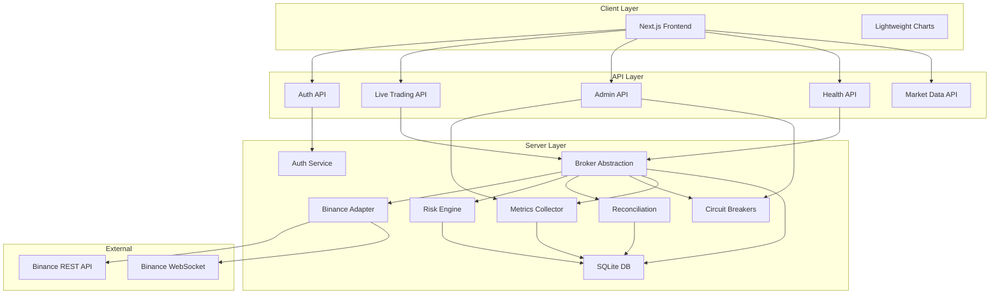
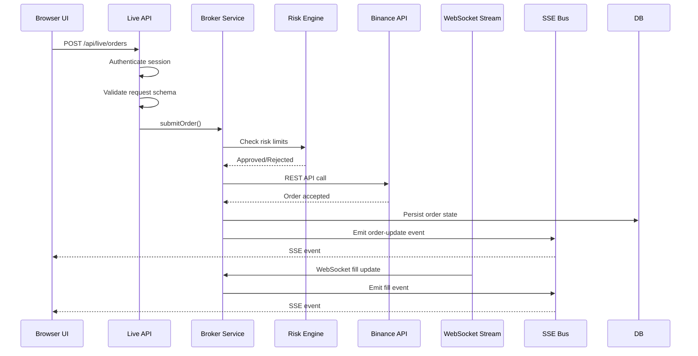
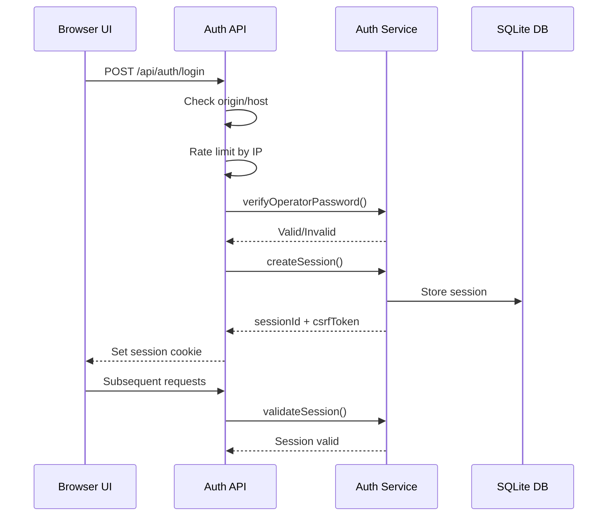

# MAWS Documentation

**Market Analysis & Workflow System**

MAWS is a local multi-chart terminal for market analysis and trading workflows with live trading capabilities through broker integration.

## Overview

MAWS provides a secure, browser-based interface for cryptocurrency futures trading with real-time market data, order management, position tracking, and risk controls. It supports multiple deployment modes from local paper trading to production execution.

### Key Features

- **Multi-Chart Terminal**: Simultaneous chart analysis with custom indicators and drawings
- **Live Trading**: Direct integration with Binance USD-M Futures (testnet and production)
- **Broker Abstraction**: Extensible interface for multi-broker support (currently Binance)
- **Risk Management**: Configurable risk limits, price collars, and execution gates
- **Circuit Breakers**: Automatic failure isolation and recovery for external dependencies
- **Real-time Events**: Server-sent events for live order/position/account updates
- **Metrics & Observability**: In-memory metrics collection with P&L tracking
- **Secure Authentication**: Operator credential system with session management

## Architecture



## Key Concepts

### Deployment Modes

MAWS supports four environment modes with progressively stricter requirements:

- **local**: Paper trading only, no broker integration, no authentication required
- **testnet**: Binance USD-M Futures Testnet, requires authentication and testnet credentials
- **shadow**: Production market data with read-only account, zero order submissions
- **production**: Real trading, requires all risk limits and execution gates enabled

### Broker Abstraction

The system uses a broker-agnostic interface (`IBroker`) that normalizes operations across exchanges:

- Normalized types: `"buy"/"sell"` instead of `"BUY"/"SELL"`
- Event-driven updates via SSE instead of polling
- Async initialization with connection lifecycle management
- Stateless operations with external state authority

### Circuit Breakers

Three independent circuit breakers protect against cascading failures:

- **REST API Breaker**: Opens after 5 failures in 60s, retries after 30s
- **WebSocket Stream Breaker**: Opens after 3 failures in 5min, retries after 60s
- **Reconciliation Breaker**: Opens after 3 failures in 10min, retries after 120s

### Risk Controls

Multiple layers of risk protection:

- **Static Limits**: Configurable max order notional, gross exposure, open orders/positions
- **Price Collars**: Rejects orders with prices outside acceptable percentage
- **Execution Gates**: Runtime flag required for production submissions
- **Daily Loss Limits**: Percentage-based daily loss protection

## Data Flow

### Order Submission Flow



### Authentication Flow



## Deployment Model

### Local Development

```bash
npm run dev
```

- Runs on http://localhost:3000
- Uses mock broker (no real trading)
- No authentication required
- SQLite database in `.maws/maws.db`

### Production Deployment

MAWS is designed for deployment behind a reverse proxy (nginx):

1. **Environment Configuration**: Set `MAWS_ENV=production` with all required variables
2. **Reverse Proxy**: nginx handles TLS, static files, and proxying to Next.js
3. **Service Management**: systemd service for process management
4. **Database**: SQLite with WAL mode for performance
5. **Backups**: Encrypted backups with AES-256 key

### Docker Deployment

A Dockerfile is provided for containerized deployment:

```bash
docker build -f deploy/Dockerfile -t maws .
docker run -p 3000:3000 --env-file .env maws
```

## Security Model

### Authentication

- **Operator Credentials**: Scrypt-hashed password with salt stored in environment
- **Session Management**: Secure HTTP-only cookies with CSRF tokens
- **Origin Validation**: Strict origin/host checking to prevent CSRF
- **Rate Limiting**: Per-IP rate limiting on login attempts

### Data Protection

- **Secrets Management**: All secrets in environment variables, never in code
- **Database Permissions**: SQLite file with mode 0600 (owner read/write only)
- **Backup Encryption**: AES-256 encryption for database backups
- **Credential Isolation**: Broker credentials never exposed to client

### Network Security

- **Allowed Origins**: Single trusted origin configurable via environment
- **Proxy Trust**: Optional proxy mode for reverse proxy deployments
- **Health Token**: Shared token for external monitoring without session
- **TLS**: Recommended for all non-local deployments

### Risk Controls

- **Environment Enforcement**: Local mode refuses broker credentials
- **Production Requirements**: All risk limits must be positive finite numbers
- **Execution Gates**: Dual requirement (static env var + runtime flag)
- **Shadow Mode**: Read-only enforcement, zero submissions allowed

## Runbook

### Starting the System

#### Local Development

```bash
# Install dependencies
npm install

# Start development server
npm run dev
```

#### Production

```bash
# Set the startup environment (still authoritative in Phase 1)
export MAWS_ENV=production
export MAWS_DEFAULT_PROFILE=paper
export MAWS_OPERATOR_AUTH=<salt:hash>
export MAWS_BINANCE_PRODUCTION_API_KEY=<key>
export MAWS_BINANCE_PRODUCTION_API_SECRET=<secret>
export MAWS_BINANCE_PRODUCTION_EXECUTION_ENABLED=false
# Legacy MAWS_BINANCE_API_KEY/SECRET remain supported during migration.
# ... other required variables

# Build and start
npm run build
npm start
```

Or using systemd:

```bash
sudo systemctl start maws
sudo systemctl enable maws
```

### Stopping the System

#### Development

Ctrl+C in the terminal running `npm run dev`

#### Production

```bash
sudo systemctl stop maws
```

### Environment Variables

Critical environment variables (see `.env.example` for complete list):

- `MAWS_ENV`: Deployment mode (local|testnet|shadow|production)
- `MAWS_DEFAULT_PROFILE`: Safe profile metadata default (paper unless explicitly set)
- `MAWS_OPERATOR_AUTH`: Operator credential hash
- `MAWS_BINANCE_TESTNET_API_KEY/SECRET`: Separate testnet credentials
- `MAWS_BINANCE_PRODUCTION_API_KEY/SECRET`: Separate production credentials
- `MAWS_BINANCE_API_KEY/SECRET`: Legacy active-profile credential aliases
- `MAWS_EXECUTION_ENABLED`: Existing global static execution gate
- `MAWS_RISK_*`: Risk limit configurations
- `MAWS_CB_*`: Circuit breaker configurations

### Health Checks

#### Basic Health Check

```bash
curl http://localhost:3000/api/health
```

Response includes:
- Environment mode
- Broker connection status
- Stream health
- Reconciliation status
- Execution gate state
- Circuit breaker states

#### Health Check with Token

```bash
curl -H "x-maws-health-token: <token>" http://localhost:3000/api/health
```

#### Admin Metrics

```bash
curl http://localhost:3000/api/admin/metrics
```

### Troubleshooting

#### Broker Connection Issues

**Symptom**: "Could not reach the exchange" error

**Causes**:
- Invalid API credentials
- Network connectivity issues
- Binance API rate limiting
- Circuit breaker open

**Resolution**:
1. Check broker health: `GET /api/health/broker`
2. Verify credentials in environment
3. Check circuit breaker status: `GET /api/admin/circuits`
4. Review server logs for specific errors

#### Authentication Failures

**Symptom**: 401/403 errors on login or API calls

**Causes**:
- Invalid operator password
- Session expired
- Origin/host mismatch
- Rate limiting

**Resolution**:
1. Verify `MAWS_OPERATOR_AUTH` format
2. Check browser console for origin errors
3. Clear cookies and retry
4. Check server logs for audit trail

#### Order Rejections

**Symptom**: Orders rejected with 422 status

**Causes**:
- Risk limit breach
- Price collar violation
- Execution gate closed
- Invalid order parameters
- Circuit breaker open

**Resolution**:
1. Check risk limits in configuration
2. Verify order parameters match symbol constraints
3. Ensure execution gate is enabled: `POST /api/live/gates`
4. Check circuit breaker status
5. Review specific error message in response

#### Stream Disconnections

**Symptom**: SSE events stop arriving

**Causes**:
- WebSocket connection failure
- Network issues
- Binance listen key expiration
- Circuit breaker open

**Resolution**:
1. Check stream status: `GET /api/live/stream-status`
2. Verify broker is connected: `GET /api/health`
3. Check circuit breaker status
4. Manual reconnect: `POST /api/live/connect`

#### Database Issues

**Symptom**: Errors related to database operations

**Causes**:
- File permissions
- Disk space
- Corruption

**Resolution**:
1. Check `.maws/maws.db` file permissions (should be 0600)
2. Verify disk space available
3. Restore from backup if needed: `node scripts/restore-backup.mjs`

#### Circuit Breaker Issues

**Symptom**: Operations rejected with "circuit open" errors

**Causes**:
- Too many failures in time window
- External service degradation
- Network issues

**Resolution**:
1. Check circuit status: `GET /api/admin/circuits`
2. Wait for automatic recovery timeout
3. Manual reset (cautious): `POST /api/admin/circuits/reset`
4. Address root cause of failures

### Backup and Restore

#### Create Backup

Backups are created automatically via scheduled jobs or manually:

```bash
# Manual backup (requires MAWS_BACKUP_KEY set)
node scripts/backup.mjs
```

Backups are stored in `.maws/backups/` with `.db.enc` extension.

#### Restore from Backup

```bash
# Dry run to verify
node scripts/restore-backup.mjs .maws/backups/<file>.db.enc --dry-run

# Actual restore
node scripts/restore-backup.mjs .maws/backups/<file>.db.enc
```

### Incident Response

#### Critical: Orders Not Executing

1. Immediately check execution gate: `GET /api/health`
2. Verify circuit breakers: `GET /api/admin/circuits`
3. Check broker connection: `GET /api/health/broker`
4. Review recent fills and order status
5. If urgent, manually close positions via exchange UI

#### Critical: Unexpected Position State

1. Trigger manual reconciliation: `POST /api/live/reconcile`
2. Compare broker state with local state
3. Check for fills missed by stream
4. Review audit logs for discrepancies

#### High: Stream Degradation

1. Check stream status: `GET /api/live/stream-status`
2. Monitor reconnection attempts
3. Check WebSocket circuit breaker
4. Consider manual reconnect if needed

#### Medium: Performance Issues

1. Check metrics: `GET /api/admin/metrics`
2. Review API latency histograms
3. Check database query performance
4. Monitor memory usage

## Additional Documentation

- [Architecture Details](ARCHITECTURE.md) - Module design, dependencies, and sequence diagrams
- [API Reference](API.md) - Complete API endpoint documentation
- [Operations Guide](OPERATIONS.md) - Environment variables, configuration, and operational procedures
- [Developer Guide](DEVELOPER.md) - Local setup, testing, and development workflow
- [Security Model](SECURITY.md) - Authentication, secrets, and security practices
- [Architecture Decisions](DECISIONS/) - ADRs for major technical choices
- [Runbooks](runbooks/) - Operational runbooks for common procedures

## See Also

- [Obsidian Vault](../obsidian-vault/Home.md) - Interactive documentation with linked notes and diagrams
